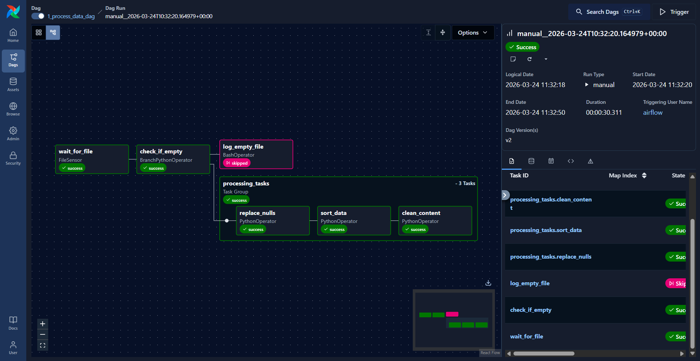
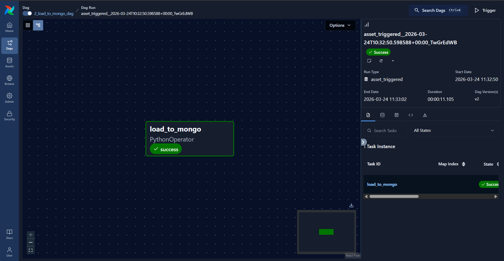
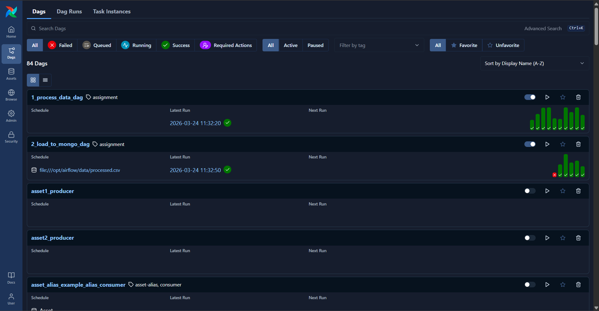
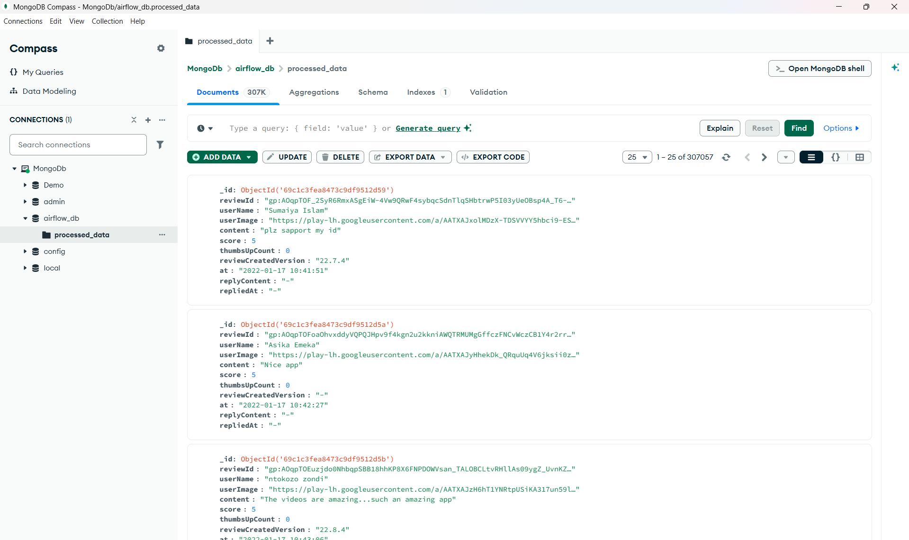
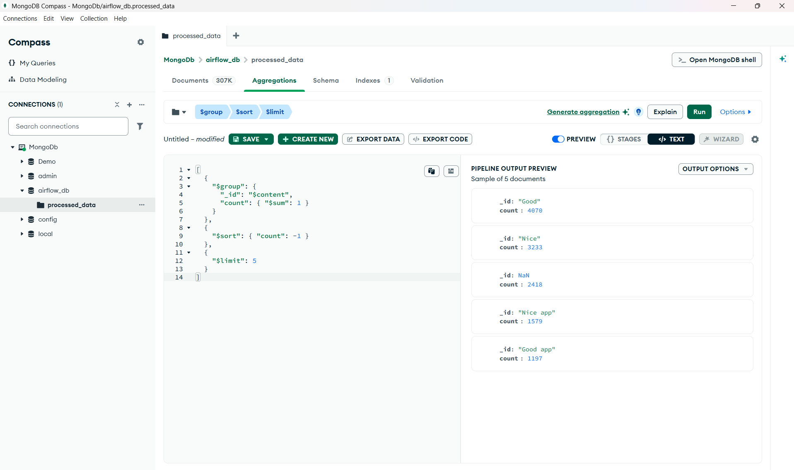
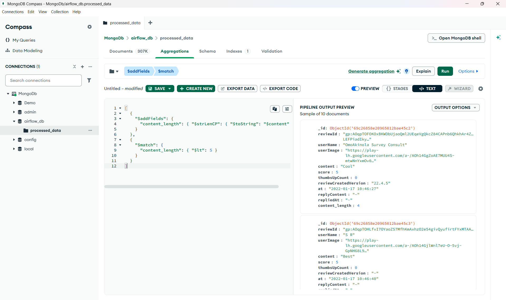
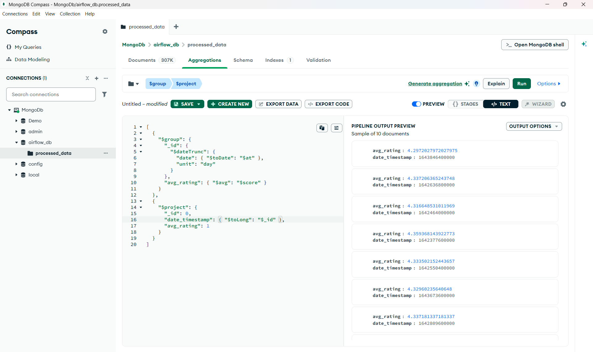

# airflow_project
This project showcases a local airflow setup with mongo databases. The pipeline starts by loading a csv file, cleans it and then load the dataset into mongodb database.

## Prerequisites
.env file containing the following: 
* AIRFLOW_UID=50000 
* _PIP_ADDITIONAL_REQUIREMENTS=pandas pymongo apache-airflow-providers-mongo

## Dag 1

## Dag 2

## Execution of both dags after each other

## Cleaned Dataset In MongoDb Compass

## Query 1

## Query 2

## Query 3

